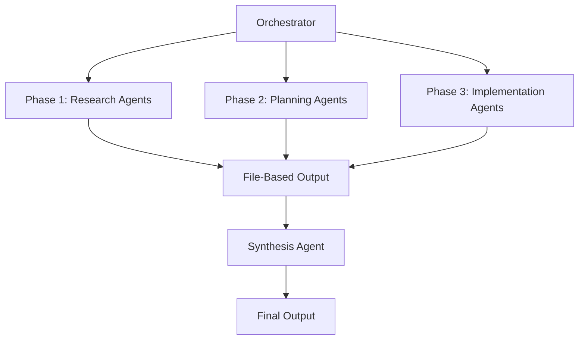

# Advanced Parallel Execution Guide for AI IDEs

## Overview

This guide details advanced parallel execution strategies for maximizing efficiency when using the PRP Framework with AI IDEs. Learn how to orchestrate 25+ agents simultaneously and achieve 4-10x speedups.

## Table of Contents

1. [Parallel Execution Fundamentals](#parallel-execution-fundamentals)
2. [Agent Orchestration Patterns](#agent-orchestration-patterns)
3. [Advanced Parallelization Techniques](#advanced-parallelization-techniques)
4. [Optimization Strategies](#optimization-strategies)
5. [Real-World Scenarios](#real-world-scenarios)
6. [Troubleshooting Parallel Execution](#troubleshooting-parallel-execution)

---

## Parallel Execution Fundamentals

### Core Principles

1. **Task Independence**: Each agent must operate without dependencies on other agents
2. **Resource Isolation**: Unique output paths prevent write conflicts
3. **Time Boxing**: Strict time limits ensure predictable completion
4. **Phase Synchronization**: Clear gates between execution phases
5. **Result Aggregation**: Structured synthesis of parallel outputs

### Parallel Execution Formula

```
Speedup = (Sequential Time) / (Parallel Time + Overhead)
Efficiency = Speedup / Number of Agents

Target: 70-85% efficiency for optimal resource usage
```

### Agent Communication Architecture



---

## Agent Orchestration Patterns

### Pattern 1: Phased Parallel Execution

```bash
# Command structure for phased execution
/hackathon-prp-parallel "Build feature"

# Execution timeline
Phase 1: Research & Specification (5 agents) ──────┐ 10 min
Phase 2: Planning & Architecture (5 agents) ───────┤ 10 min  
Phase 3: Implementation (10 agents) ────────────────┤ 15 min
Phase 4: Integration (2 agents) ────────────────────┤ 3 min
Phase 5: Quality Assurance (3 agents) ──────────────┘ 2 min
                                          Total: 40 minutes
```

### Pattern 2: Competitive Parallel Research

```bash
# Spawn competing approaches
/hackathon-research "Solve problem X"

# Agent distribution
Speed-First Team (5 agents)     ┐
Innovation-First Team (5 agents) ├─── 15 min concurrent
Balanced Team (5 agents)         ┘

# Output: Quantitative comparison matrix
```

### Pattern 3: Specialized Domain Parallelism

```bash
# Domain-specific agent teams
/create-base-prp-parallel "Complex feature"

Agent 1: Backend Architecture  ┐
Agent 2: Frontend Architecture ├─── Concurrent execution
Agent 3: Database Design       │
Agent 4: Testing Strategy      ┘
```

### Pattern 4: Hierarchical Task Distribution

```
Master Orchestrator
├── Research Coordinator
│   ├── Codebase Analyst (3 agents)
│   ├── Documentation Researcher (2 agents)
│   └── Best Practices Scout (2 agents)
├── Implementation Coordinator
│   ├── Backend Team (5 agents)
│   ├── Frontend Team (5 agents)
│   └── Infrastructure Team (3 agents)
└── Quality Coordinator
    ├── Testing Team (3 agents)
    ├── Security Auditor (1 agent)
    └── Performance Analyzer (1 agent)
```

---

## Advanced Parallelization Techniques

### Technique 1: Dynamic Agent Allocation

```python
# Pseudo-code for dynamic allocation
def allocate_agents(task_complexity, time_constraint):
    if task_complexity > 0.8 and time_constraint < 60:
        return {
            'research': 10,
            'implementation': 15,
            'qa': 5
        }
    elif task_complexity > 0.5:
        return {
            'research': 5,
            'implementation': 10,
            'qa': 3
        }
    else:
        return {
            'research': 3,
            'implementation': 5,
            'qa': 2
        }
```

### Technique 2: Adaptive Time Boxing

```bash
# Time allocation based on phase success
Phase 1: 10 min (can extend +2 min if 80% complete)
Phase 2: 10 min (can borrow from Phase 3 if critical)
Phase 3: 15 min (minimum 10 min guaranteed)
Phase 4: 3 min (can skip if Phase 3 includes integration)
Phase 5: 2 min (mandatory, cannot skip)
```

### Technique 3: Parallel Validation Cascades

```
Implementation Agent 1 ─┐
                       ├─→ Validation Agent A ─┐
Implementation Agent 2 ─┘                      ├─→ Integration Test
                                               │
Implementation Agent 3 ─┐                      │
                       ├─→ Validation Agent B ─┘
Implementation Agent 4 ─┘
```

### Technique 4: Result Pipelining

```bash
# Continuous processing pipeline
while not all_phases_complete:
    completed = check_completed_agents()
    for agent_output in completed:
        spawn_next_phase_agent(agent_output)
        
# Enables overlapping phases for faster completion
```

---

## Optimization Strategies

### Strategy 1: Agent Pool Management

```yaml
Agent Pool Configuration:
  small_tasks:
    min_agents: 2
    max_agents: 5
    timeout: 300s
  
  medium_tasks:
    min_agents: 5
    max_agents: 15
    timeout: 600s
    
  large_tasks:
    min_agents: 10
    max_agents: 30
    timeout: 1200s
```

### Strategy 2: Intelligent Task Partitioning

```python
# Task partitioning algorithm
def partition_tasks(feature_requirements):
    tasks = []
    
    # Analyze dependencies
    dependency_graph = build_dependency_graph(feature_requirements)
    
    # Find independent task clusters
    independent_clusters = find_independent_clusters(dependency_graph)
    
    # Assign to parallel agents
    for cluster in independent_clusters:
        tasks.append({
            'agents': calculate_optimal_agents(cluster.complexity),
            'priority': cluster.business_value,
            'timeout': estimate_time(cluster)
        })
    
    return optimize_schedule(tasks)
```

### Strategy 3: Resource-Aware Scheduling

```bash
# Check available resources before spawning
available_agents = get_available_agent_count()
task_priority_queue = sort_by_priority(pending_tasks)

for task in task_priority_queue:
    required_agents = task.optimal_agents
    if required_agents <= available_agents:
        spawn_agents(task, required_agents)
        available_agents -= required_agents
    else:
        # Use available agents even if suboptimal
        spawn_agents(task, available_agents)
        break
```

### Strategy 4: Failure Recovery Optimization

```yaml
Recovery Strategies:
  agent_timeout:
    action: reassign_to_backup_agent
    max_retries: 1
    
  partial_completion:
    action: proceed_with_available_results
    minimum_completion: 0.7
    
  phase_failure:
    action: fallback_to_sequential
    preserve_completed_work: true
```

---

## Real-World Scenarios

### Scenario 1: E-commerce Platform Overhaul

```bash
# Step 1: Massive research phase (20 agents)
/hackathon-research "Modernize legacy e-commerce platform"

# Step 2: Select microservices approach, create detailed PRPs
/parallel-prp-creation "Microservices migration" --variations 5

# Step 3: Execute with maximum parallelization (30+ agents)
/hackathon-prp-parallel "Execute microservices migration"

# Timeline: 2.5 hours vs 10+ hours sequential
```

### Scenario 2: Real-time Features Under Time Pressure

```bash
# Rapid prototyping with 15 parallel agents
/user-story-rapid "Real-time collaborative editing"

# Parallel implementation teams
Backend WebSocket Team (5 agents) ────┐
Frontend State Sync Team (5 agents) ──┼─→ 30 min total
Conflict Resolution Team (3 agents) ──┤
Testing Team (2 agents) ──────────────┘
```

### Scenario 3: Security-Critical Implementation

```bash
# Multi-angle security analysis
/hackathon-research "Implement end-to-end encryption"

# Parallel security validation
Implementation Team (10 agents) ─────┐
Security Audit Team (5 agents) ──────┼─→ Continuous validation
Penetration Test Team (3 agents) ────┘
```

### Scenario 4: Performance Optimization Sprint

```bash
# Parallel performance analysis
/create-base-prp-parallel "Optimize API response times"

# Specialized optimization agents
Database Query Optimizer (3 agents) ───┐
Caching Strategy Team (3 agents) ──────┤
Algorithm Optimizer (3 agents) ────────┼─→ 15 min analysis
Network Optimizer (2 agents) ──────────┤
Frontend Bundle Optimizer (2 agents) ──┘
```

---

## Troubleshooting Parallel Execution

### Common Issues and Solutions

#### Issue 1: Agent Conflicts
```bash
Symptom: File write conflicts, corrupted outputs
Solution: 
- Ensure unique output paths: {phase}-{agent_id}-{timestamp}.md
- Use file locking mechanisms
- Implement write queues for shared resources
```

#### Issue 2: Phase Synchronization Failures
```bash
Symptom: Next phase starts before previous completes
Solution:
- Implement strict phase gates with file count validation
- Use completion markers: .phase1_complete
- Add buffer time between phases (30s minimum)
```

#### Issue 3: Resource Exhaustion
```bash
Symptom: Agents timeout or fail to start
Solution:
- Implement agent pooling with queue
- Dynamic resource allocation based on load
- Graceful degradation to fewer agents
```

#### Issue 4: Result Aggregation Errors
```bash
Symptom: Synthesis fails or misses outputs
Solution:
- Validate expected file count before synthesis
- Implement retry logic for file reading
- Use checksums to verify output integrity
```

### Performance Monitoring

```python
# Monitor parallel execution metrics
metrics = {
    'phase_completion_times': [],
    'agent_success_rates': {},
    'resource_utilization': [],
    'output_quality_scores': []
}

# Log and analyze for optimization
def log_execution_metrics(phase, agents, duration, success_rate):
    metrics['phase_completion_times'].append({
        'phase': phase,
        'agents': agents,
        'duration': duration,
        'efficiency': calculate_efficiency(agents, duration)
    })
```

### Debug Commands

```bash
# Validate parallel execution setup
/prp-validate --check-parallel-config

# Analyze previous parallel execution
/prp-analyze-run --parallel-metrics

# Test with reduced parallelism
/hackathon-prp-parallel --debug --max-agents 5
```

---

## Best Practices Summary

1. **Start Small**: Test with 2-5 agents before scaling to 25+
2. **Monitor Resources**: Track success rates and adjust agent counts
3. **Plan Phases**: Clear boundaries prevent cascade failures
4. **Validate Outputs**: Always verify before proceeding to next phase
5. **Document Patterns**: Save successful configurations for reuse
6. **Measure Everything**: Use metrics to continuously optimize

---

## Conclusion

Mastering parallel execution in the PRP Framework enables:
- **4-10x faster development** through intelligent parallelization
- **Higher quality** through multiple perspective analysis
- **Reduced risk** through competitive approach evaluation
- **Scalability** from small features to complete system overhauls

Remember: The key to successful parallel execution is **independent tasks**, **clear phases**, and **robust synchronization**.

---

*Advanced Parallel Execution Guide v1.0 | Maximum Efficiency Through Parallelization*